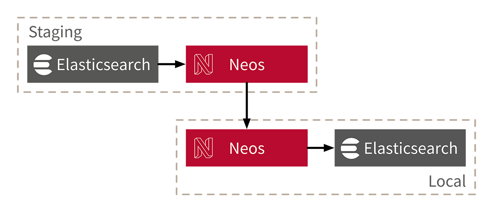

# PunktDe.Elastic.Sync

[](https://packagist.org/packages/punktDe/elastic-sync) [](https://packagist.org/packages/punktDe/elastic-sync) [](https://packagist.org/packages/punktDe/elastic-sync)



The package uses [elasticsearch-dump](https://github.com/taskrabbit/elasticsearch-dump) to sync data from a remote Elasticsearch instance to local. If you are already using a tool to sync the database and assets from a remote Neos instance to your local dev instance, you can now also copy the needed Elasticsearch indices. That saves a lot of time needed otherwise for local indexing, especially on large projects.

How the package works:

1. It gathers the Elasticsearch sync configuration from the remote server
2. Establishs a ssh tunnel to the remote server and syncs the index mapping, data and aliases through it

## Installation

Install the package via composer

```bash
composer require punktde/elastic-sync
```

Install the required JavaScript library:

```bash
(cd Packages/Application/PunktDe.Elastic.Sync/Resources/Private/Library && npm install)
```

## Configuration

You can add several presets. A preset consists of three parts

**remoteInstance** 
   
Configures how the remote server and the remote installation can be reached.

**elasticsearch** 

Describes how the Elasticsearch server instance can be reached. For the remote instance, the config is fetched from there.

**indices** 

Several indices to be fetched can be defined. The index name can contain '*' to define a group of indices:

Example for cloning the content repository indices for all content dimensions, including all aliases: 

```yaml
indices:
  contentRepository:
    indexName: 'neos*' 
```

## Usage

```bash
./flow elastic:sync <preset>
```
